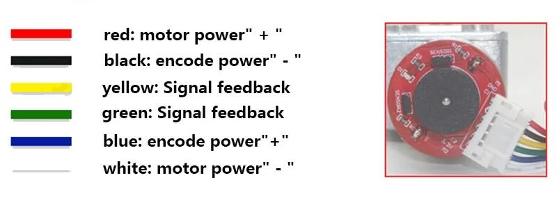

# TRIP-low-level-controller
Tracked Robotic Intelligent Platform - Low Level Controller (LLC)

The `stable` branch always represents a snapshot of the most recent tested working version. Relevant commits are also tagged and set as release. The `main` branch instead contains the work-in-progress developments. 

## Introduction
This repository contains the code of the low level controller for the TRIP robotic platform.
The goal is to provide a flexible on-board embedded device which is able to set the speed of multiple DC motors and perform precise rotation speed measurements by means of quadrature encoders.
The collected information is then used to estabilish a closed-loop feedback control system that allows, for each motor, to define absolute rotation speed setpoint values that need to be reached and maintained.

## Software architecture
The project is implemented using object-oriented-programming (OOP) and is structured following the event-driven paradigm.

Hereafter the main abstract classes are reported:

| Class name | Description|
| - | - |
| ThreadObject | Object which embeds internal cyclic timer thread |
| DCMotorAbstract | Object which embeds the logic to set relative speed values and rotation directions |
| RotaryEncoderAbstract | Object which embeds the logic to retrieve impulses count, compute istantaneous rotation speed measurements and broadcast measurement results |
| ControllerAbstract | Object which defines methods to create a closed-loop controller for the motor actuation |
| DataExchangeAbstract | Object which defines methods to create an interface between the board and external systems |

Abstract classes are then used to generate specialized derived classes, which define explicitly the interfaces between the software and the physical devices.

## Motor and encoder

The current project uses the JGY370 self-locking geared motor model, with embedded hall-effect quadrature encoder. The following image visualizes the board wiring.



The DC motors speed can then managed by using a Dual-motor Toshiba TB6612FNG-based breakout board.
Optionally, there is also support to use an Adashield-based motor shield driver.


The encoder impulses count are then managed by the `Encoder` library. An empirical test has been performed to understand with the current hardware the impact of the use of interrupt and non-interrupt pins to count impulses. The result is that at least one interrupt pin has to be used to have an acceptably low incidence of missed counts and to avoid aliasing.


It is of crucial importance to note that, for this specific library, during the instantation of the `Encoder` object, the first pin needs to be the one that supports interrupts. If both support interrupt, it is irrelevant. However if only one supports interrupt, it is crucial for configuring the pin interrupt.

## Closed-loop feedback controller

The following image shows the basic design architecture that has been followed during the implementation of the controller.


It is worth noting that in the scope of this project, the _reference input_ is the absolute speed target (RPMs), the _control input_ is the relative motor speed (0 to 100), and the _transducer_ is the rotary encoder. 

## Serial signal exchange

Both _relative_ and _absolute_ speed of each instantiated motor can be set by sending commands to the Arduino board using serial COM.

The **relative** speed of each motor can be set by sending the following message:
```
MSET, <motorNumber>, <value>
```
where motorNumber is the integer motor index, starting from zero, while the value $\in [-1.0,1.0]$ is the signed percentage speed, with dot decimal separator. The value magnitude represents the relative motor speed, with an absolute value of 1.0 as the maximum rotation speed and the value 0.0 as no rotation. The value sign embeds the direction of the revolution.

The **absolute** speed of each motor can be set by sending the following message:
```
CSET, <motorNumber>, <value>
```
where motorNumber is the integer motor index, starting from zero, while the value $\in [-\infty,\infty]$ is the signed absolute speed, with dot decimal separator. The value magnitude represents the absolute motor speed, in RPM units. The value sign embeds the direction of the revolution.

## Libraries

The following Arduino C++ libraries are required to compile successfully and run the project. All libraries listed are fully available for download and install directly from the Arduino IDE. 

| Library name | Reference link |
| - | - |
| MicroQT | https://github.com/juliusbaechle/MicroQt |
| Adafruit motor shield library | https://github.com/adafruit/Adafruit-Motor-Shield-library/tree/master |
| Encoder | https://github.com/PaulStoffregen/Encoder |
| PID | https://github.com/br3ttb/Arduino-PID-Library |
